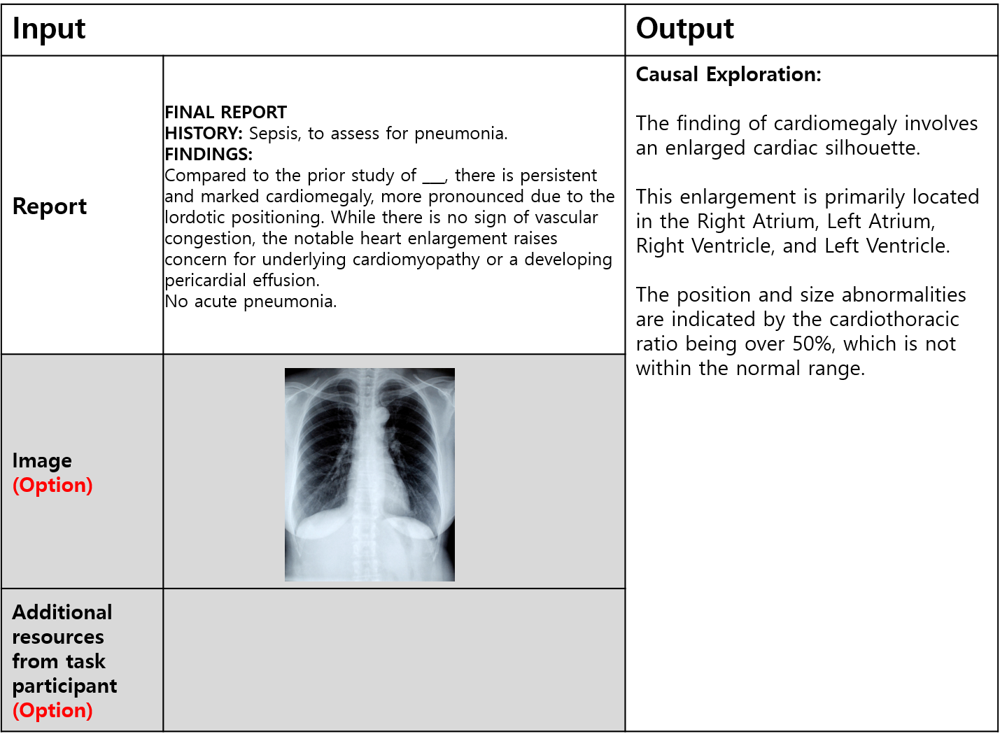
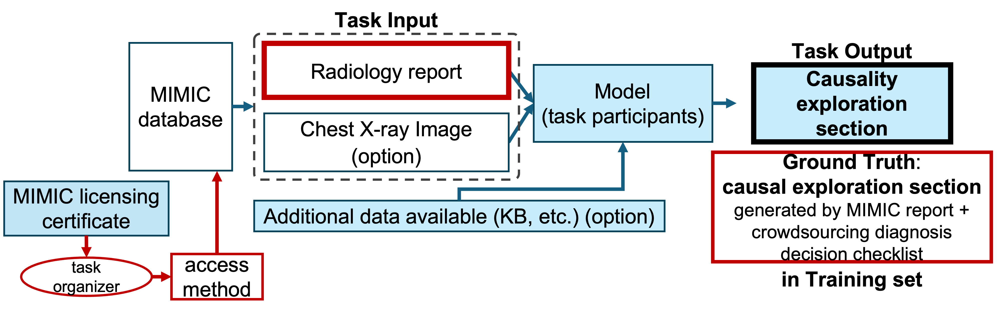

# Task 1: Recovering Causal Explanations from Radiology Reports: A Shared Task Leveraging the MIMIC Database

## Introduction
Task 1 focuses on generating a causality exploration section for the diagnosis in radiology report. Training set contains the relevant index to the Chest X-ray radiology reports and their DICOM images from the MIMIC-CXR dataset [1] with their corresponding  causality exploration sections that are collected by the  radiologists under the simulated diagnostic processes for the selected data from MIMIC-CXR dataset. The image input (DICOM) is optional, allowing participants to decide whether to include the image data as part of their analysis. Additionally, participants may choose to incorporate their own knowledge bases, ontologies, or other external resources as optional inputs, further enhancing their causality analysis with additional context and domain-specific insights.

## Example Structure of Output

# How to get the data
1. The text report parts corresponding to this training set and (optional) Chest X-ray image files originated from MIMIC database are listed in https://github.com/hidden-rad/MIMIC_data.

2. Files for causality sections are listed in https://github.com/hidden-rad/Task1/tree/main/Train.
 

## Task definition

The objective of this task is to develop a model that learns to map a set of **input data**—consisting of radiology reports, optionally accompanied by chest X-ray images—to a corresponding set of **output data** that includes a **causality exploration section**. This section would not typically be described in the initial radiology report but has been recovered and verified by radiology experts based on a structured **diagnosis confirmation checklist**.

The **input data** for this task is sourced from the **MIMIC database** [1], a large, publicly available database of healthcare information. Participants must individually acquire the necessary licensing and permissions to access MIMIC data. The task organizers will provide the access method to the relevant data for participants who hold a valid MIMIC license, enabling them to retrieve and utilize the input data in line with MIMIC’s licensing requirements.

Participants will use the provided **training set**, which includes paired examples of input data (radiology report and optional X-ray image) and output data (causality exploration section), to train a **learning module**. This module should capture the underlying patterns and infer causal information that experts derive from both the report content and the diagnosis confirmation process.

Participants are required to build a **running module** (also referred to as the **inference module**) that can take any new input (a radiology report with or without an X-ray image) and generate the corresponding causality exploration section based on the learned transformation. This module will be deployed and tested on our evaluation server via API to assess its accuracy and effectiveness on **testing inputs** that were not included in the training set.

## MIMIC Licensing

To obtain a MIMIC license, please follow the instructions below. If you already have a MIMIC license and need the MIMIC-CXR image, please refer to the 'readme.md' in the 'MIMIC_data' repository on Github: https://github.com/hidden-rad/MIMIC_data. 

This dataset is a public dataset distributed by physionet under MIMIC-CXR. In order to use the dataset, it is necessary to perform relevant training and obtain permission for use authentication from the data organizer, MIT. Since the dataset itself corresponds to a human body-derived material and contains a considerable amount of personal information, the screening process and training procedure are as follows.

1. Physionet membership: Membership registration is performed through the URL below. 
     https://physionet.org/register/ 

2. The training required for data consists of CITI courses, a detailed introduction to which can be found at https://physionet.org/about/citi-course/ (must read). 

3. To take the CITI course, you will need to create an account at https://about.citiprogram.org/ , and there are a few things to keep in mind.

     * You need to “Add affiliation” in “My Courses”, please search for “Massachusetts Institute of Technology Affiliates” to register. You can also register as an “independent learner” and pay the fee.

     * When registering by email, use your institutional address, not your personal address, if possible.

     * Answer questions 1-3 to take the “Data or Specimens Only Research” course. For question 5, answer “yes” to “conflict of interest”.

     It may take a while to confirm your enrollment afterward.

4. Education is a form of examination based on electronic documents, and the training site is https://www.citiprogram.org/members/index.cfm?pageID=50. There is a wide variety of training, but there is a list of things you need to do to get the data. The list of trainings can be found at the URL above.

5. Download Certification and Submit Certificates: You can download certification from "My Records" after completing all of the training. Subsequently, the downloaded certificate is submitted at https://physionet.org/settings/training/.

6. Create Data Utilization Consent: At the bottom of the link above https://physionet.org/content/mimic-cxr/2.1.0/, there is a final process including the contents introduced so far. If you click on the data usage agreement and sign in after logging in, a review is requested to MIT. 

## MIMIC Data Folder structure

To view the structure of the MIMIC data folders, please refer to the Data Description section on the MIMIC-CXR database description page: https://physionet.org/content/mimic-cxr/2.1.0/ [1]. Specific details are available under Overview and Folder Structure of Data Description section.

### References
[1] Johnson, A., Pollard, T., Mark, R., Berkowitz, S., & Horng, S. (2024). MIMIC-CXR Database (version 2.1.0). PhysioNet. https://doi.org/10.13026/4jqj-jw95. 
[2] Johnson, A.E.W., Pollard, T.J., Berkowitz, S.J., et al. (2019). MIMIC-CXR, a de-identified publicly available database of chest radiographs with free-text reports. Scientific Data, 6, 317. https://doi.org/10.1038/s41597-019-0322-0. 
[3] Goldberger, A., Amaral, L., Glass, L., Hausdorff, J., Ivanov, P. C., Mark, R., ... & Stanley, H. E. (2000). PhysioBank, PhysioToolkit, and PhysioNet: Components of a new research resource for complex physiologic signals. Circulation, 101 (23), pp. e215–e220.

## Data Format
The data for Task 1 is provided in CSV format, containing relevant information for each case in a structured tabular form. Each row in the CSV file represents a single case, with the following columns:

### MIMIC Data part
#### Dir: 
This directory path contains the MIMIC-CXR files. It includes the reports (text files) and images (DICOM files) corresponding to each case. Participants can use this path to access the relevant files for processing. 
Example: **./physionet.org/files/mimic-cxr/2.1.0/files/p13/p13369881**

#### Report_name: 
The name of the report file associated with each case. Each report provides a detailed analysis of the patient’s condition, which will serve as the basis for the causality exploration. 
Example: **s54086770.txt**

#### DICOM_name: 
The name of the DICOM file, which contains the CXR (Chest X-Ray) image associated with the report. Although the main focus is on the text report, participants may choose to incorporate image analysis if relevant. 
Example: **07145c92-7fd06870-9d53917d-067ad184-dbaa11d8.dcm**

### Ground-truth part
#### Causal section:
A unique identifier for each case, linking it to a ground-truth causality report. The ground-truth report is created by radiologists and contains validated causality relationships, which participants can use as a benchmark for validation and evaluation of their own models. 
Example: **182f51c3-e5bc-4c19-97c1-3f427bf25af9**

## Output
The output of Task 1 is a causality exploration report. This report should provide a structured analysis of the radiology findings, highlighting potential causative relationships that could lead to a better understanding of the patient's condition. The report should reflect the diagnostic reasoning process by documenting how various symptoms and findings may be interlinked. For example, a finding of "pleural effusion" may be linked causally to "heart failure" if observed in the patient's medical history.

The report must begin with the fixed heading **"Causal Exploration:"** followed by the causality analysis text that reflects the diagnostic flow and reasoning. This structured format is required for consistency. The output format should clearly delineate identified causal links and any inferred reasoning steps that mimic a radiologist’s analytical process.

## Process
**Data Access**: Locate the MIMIC-CXR data files using the directory path (Dir) and file names (Report_name and DICOM_name). Ensure you have the necessary permissions and tools to read both text and DICOM formats. 
**Analyze the Report**: Process the text report to extract relevant medical terms, symptoms, findings, and potential diagnoses. 
**Generate Causality Analysis**: Using your own model or method, identify and document causal relationships. For example, you may employ a text analysis model that recognizes patterns indicative of causation, such as certain phrasing or repeated co-occurrences of terms. 
**Format the Report**: Structure the causality analysis into a clear format. Create a section titled "Causal Exploration" where you will output the analyzed causality information. This "Causal Exploration" section should capture all identified causative links and reasoning based on the provided data. Submit this "Causal Exploration" section, not the full report.

