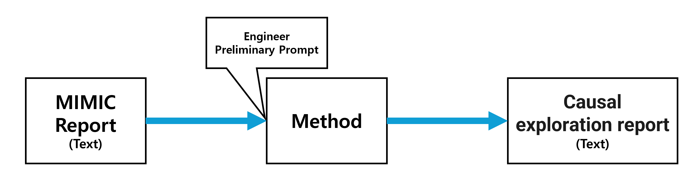
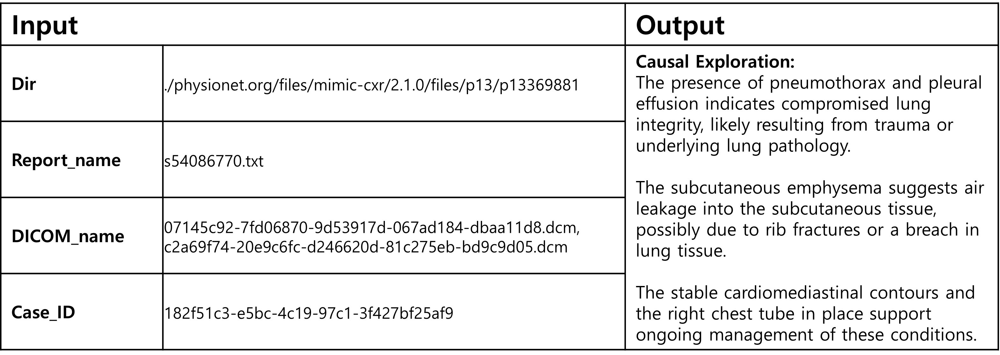

# Task 1 : Generating Causality Reports

## Introduction
Task 1 focuses on generating causality reports based on MIMIC-CXR data. The objective is to utilize radiology reports and images from the MIMIC-CXR dataset to uncover hidden causality relationships within the diagnostic process. Participants are tasked with using data to develop their own methods or models that can interpret the report content, aiming to generate a causality exploration report that mirrors the thought process of a radiologist.

## Goal
The primary goal of Task 1 is to simulate diagnostic reasoning by identifying and documenting causality in radiology reports. By analyzing the MIMIC-CXR data, the generated causality report will help provide insights into the connections between findings, symptoms, and potential diagnoses. This task challenges participants to go beyond simple data analysis and delve into the reasoning process, offering a deeper understanding of radiological findings and their causal relationships.

## Data Format
#### Dir: 
This directory path contains the MIMIC-CXR files. It includes the reports (text files) and images (DICOM files) corresponding to each case. Participants can use this path to access the relevant files for processing. 
Example: **./physionet.org/files/mimic-cxr/2.1.0/files/p13/p13369881**

#### Report_name: 
The name of the report file associated with each case. Each report provides a detailed analysis of the patient’s condition, which will serve as the basis for the causality exploration. 
Example: **s54086770.txt**

#### DICOM_name: 
The name of the DICOM file, which contains the CXR (Chest X-Ray) image associated with the report. Although the main focus is on the text report, participants may choose to incorporate image analysis if relevant. 
Example: **07145c92-7fd06870-9d53917d-067ad184-dbaa11d8.dcm**

#### Case_ID:
A unique identifier for each case, linking it to a ground-truth causality report. The ground-truth report is created by radiologists and contains validated causality relationships, which participants can use as a benchmark for validation and evaluation of their own models. 
Example: **182f51c3-e5bc-4c19-97c1-3f427bf25af9**

## Output
The output of Task 1 is a causality exploration report. This report should provide a structured analysis of the radiology findings, highlighting potential causative relationships that could lead to a better understanding of the patient's condition. The report should reflect the diagnostic reasoning process by documenting how various symptoms and findings may be interlinked. For example, a finding of "pleural effusion" may be linked causally to "heart failure" if observed in the patient's medical history.

This exploration report should be generated through the participant’s own approach, using a method they design and implement based on the provided data. The output format should clearly delineate identified causal links and any inferred reasoning steps that mimic a radiologist’s analytical process.

## Process
**Data Access**: Locate the MIMIC-CXR data files using the directory path (Dir) and file names (Report_name and DICOM_name). Ensure you have the necessary permissions and tools to read both text and DICOM formats. 
**Analyze the Report**: Process the text report to extract relevant medical terms, symptoms, findings, and potential diagnoses. 
**Generate Causality Analysis**: Using your own model or method, identify and document causal relationships. For example, you may employ a text analysis model that recognizes patterns indicative of causation, such as certain phrasing or repeated co-occurrences of terms. 
**Format the Report**: Structure the causality analysis into a clear format. Create a section titled "Causal Exploration" where you will output the analyzed causality information. This "Causal Exploration" section should capture all identified causative links and reasoning based on the provided data. Submit this "Causal Exploration" section, not the full report.

## Example Structure of Output

## Evaluation
To evaluate the effectiveness of the generated "Causal Exploration" output, the following metrics will be applied:

#### BLEU: 
Measures the precision of the generated causality text by comparing it to reference text, evaluating word overlap and sequence accuracy.

#### ROUGE : 
Focuses on recall by measuring how much of the reference causality information is captured in the generated output.

#### METEOR : 
Considers exact matches, synonyms, and stemming to provide a nuanced similarity measure between generated and reference text.

#### BERT Score: 
A semantic similarity metric that uses contextual embeddings to assess how well the generated text captures the meaning of the reference causality.

#### Cosine Similarity: 
Measures the similarity between the generated causality vector and the reference causality vector. This metric evaluates how closely the generated causality aligns with the reference in semantic space.

#### BioSentVec-based Evaluation: 
BioSentVec, a model trained on PubMed and MIMIC-III clinical notes, will be used to generate sentence embeddings for both the generated and reference causality texts. Cosine similarity will then be applied to these embeddings to measure coherence and semantic accuracy in the biomedical context.

These evaluation metrics provide a comprehensive assessment of the quality and accuracy of the "Causal Exploration" section, ensuring that it aligns with the reference data both in terms of content and semantic meaning.
