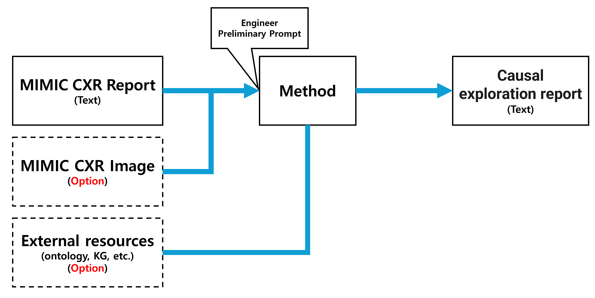
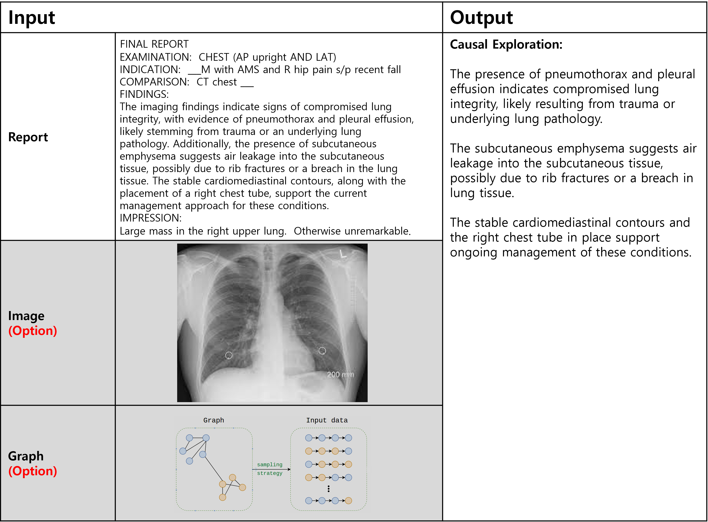

# Task 1: Generating Causality Reports

## Introduction
Task 1 focuses on generating a causality exploration section for the diagnosis in a radiology report. Training set contains the relevant index to the Chest X-ray radiology reports and their DICOM images from the MIMIC-CXR dataset [1] with their corresponding  causality exploration sections that are collected by the  radiologists under the simulated diagnostic processes for the selected data from MIMIC-CXR dataset. The image input (DICOM) is optional, allowing participants to decide whether to include the image data as part of their analysis. Additionally, participants may choose to incorporate their own knowledge bases, ontologies, or other external resources as optional inputs, further enhancing their causality analysis with additional context and domain-specific insights.

## Goal
The goal is to simulate diagnostic reasoning by identifying and documenting causality within radiology reports. Participants will generate a causality exploration section that reflects a radiologist’s diagnosis process for a given radiology report and optional image through learning from the training dataset. This process can be enriched by optionally external resources, such as custom knowledge bases or ontologies, to improve the accuracy and depth of the causality exploration.

## MIMIC Licensing
You will need a MIMIC license to participate in this Task 1.

To obtain a MIMIC license, please follow the instructions below. If you already have a MIMIC license and need the MIMIC-CXR image, please refer to the 'readme.md' in the 'MIMIC_data' repository on Github.

## MIMIC Licensing Permissions

This dataset is a public dataset distributed by physionet under MIMIC-CXR. In order to use the dataset, it is necessary to perform relevant training and obtain permission for use authentication from the data organizer, MIT. Since the dataset itself corresponds to a human body-derived material and contains a considerable amount of personal information, the screening process and training procedure are as follows.

1. Physionet membership Membership registration is performed through the URL below. 

     https://physionet.org/content/mimic-cxr/2.1.0/

2. Completion of training required for data The training consists of a CITI Course, and the basic introduction can be found at https://physionet.org/about/citi-course/ . Education is a form of examination based on electronic documents, and the training site is https://www.citiprogram.org/members/index.cfm?pageID=50. There is a list of things to do to obtain data, although there is a variety of education. The training list can be found at the URL above.

3. Download Certification and Submit Certificates You can download certification from "My Records" after completing all of the training. Subsequently, the downloaded certificate is submitted at https://physionet.org/settings/training/.

4. Create Data Utilization Consent At the bottom of the link above https://physionet.org/content/mimic-cxr/2.1.0/, there is a final process including the contents introduced so far. If you click on the data usage agreement and sign in after logging in, a review is requested to MIT. 

5. If you have completed all the steps up to this point and have been reviewed by MIT, please forward your MIT certificate and data use authorization documentation via Google Form. We will review the MIT certificate and data use authorization documentation together to determine whether to approve.

## MIMIC Data Folder structure

To view the structure of the MIMIC data folders, please refer to the Data Description section on the MIMIC-CXR dataset page: https://physionet.org/content/mimic-cxr/2.1.0/. Specific details are available under Overview and Folder Structure.

### References
+ Johnson, A., Pollard, T., Mark, R., Berkowitz, S., & Horng, S. (2024). MIMIC-CXR Database (version 2.1.0). PhysioNet. https://doi.org/10.13026/4jqj-jw95. 
+ Johnson, A.E.W., Pollard, T.J., Berkowitz, S.J., et al. (2019). MIMIC-CXR, a de-identified publicly available database of chest radiographs with free-text reports. Scientific Data, 6, 317. https://doi.org/10.1038/s41597-019-0322-0. 
+ Goldberger, A., Amaral, L., Glass, L., Hausdorff, J., Ivanov, P. C., Mark, R., ... & Stanley, H. E. (2000). PhysioBank, PhysioToolkit, and PhysioNet: Components of a new research resource for complex physiologic signals. Circulation, 101 (23), pp. e215–e220.

## Data Format
The data for Task 1 is provided in CSV format, containing relevant information for each case in a structured tabular form. Each row in the CSV file represents a single case, with the following columns:

### MIMIC Data part
#### Dir: 
This directory path contains the MIMIC-CXR files. It includes the reports (text files) and images (DICOM files) corresponding to each case. Participants can use this path to access the relevant files for processing. 
Example: **./physionet.org/files/mimic-cxr/2.1.0/files/p13/p13369881**

#### Report_name: 
The name of the report file associated with each case. Each report provides a detailed analysis of the patient’s condition, which will serve as the basis for the causality exploration. 
Example: **s54086770.txt**

#### DICOM_name: 
The name of the DICOM file, which contains the CXR (Chest X-Ray) image associated with the report. Although the main focus is on the text report, participants may choose to incorporate image analysis if relevant. 
Example: **07145c92-7fd06870-9d53917d-067ad184-dbaa11d8.dcm**

### Ground-truth part
#### Causal section:
A unique identifier for each case, linking it to a ground-truth causality report. The ground-truth report is created by radiologists and contains validated causality relationships, which participants can use as a benchmark for validation and evaluation of their own models. 
Example: **182f51c3-e5bc-4c19-97c1-3f427bf25af9**

## Output
The output of Task 1 is a causality exploration report. This report should provide a structured analysis of the radiology findings, highlighting potential causative relationships that could lead to a better understanding of the patient's condition. The report should reflect the diagnostic reasoning process by documenting how various symptoms and findings may be interlinked. For example, a finding of "pleural effusion" may be linked causally to "heart failure" if observed in the patient's medical history.

This exploration report should be generated through the participant’s own approach, using a method they design and implement based on the provided data. The report must begin with the fixed heading **"Causal Exploration:"** followed by the causality analysis text that reflects the diagnostic flow and reasoning. This structured format is required for consistency. The output format should clearly delineate identified causal links and any inferred reasoning steps that mimic a radiologist’s analytical process.

## Process
**Data Access**: Locate the MIMIC-CXR data files using the directory path (Dir) and file names (Report_name and DICOM_name). Ensure you have the necessary permissions and tools to read both text and DICOM formats. 
**Analyze the Report**: Process the text report to extract relevant medical terms, symptoms, findings, and potential diagnoses. 
**Generate Causality Analysis**: Using your own model or method, identify and document causal relationships. For example, you may employ a text analysis model that recognizes patterns indicative of causation, such as certain phrasing or repeated co-occurrences of terms. 
**Format the Report**: Structure the causality analysis into a clear format. Create a section titled "Causal Exploration" where you will output the analyzed causality information. This "Causal Exploration" section should capture all identified causative links and reasoning based on the provided data. Submit this "Causal Exploration" section, not the full report.

## Example Structure of Output

